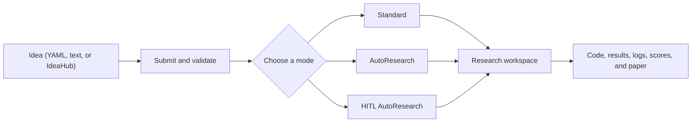

<div align="center">


[](https://github.com/ChicagoHAI/neurico)
[](https://www.python.org/downloads/)
[](docker/)
[](LICENSE)
[](https://x.com/ChicagoHAI)
[](https://discord.gg/n65caV7NhC)

</div>

<!-- agent-summary: NeuriCo is an autonomous and human-in-the-loop research framework. Users install it with Docker or uv, submit a research idea, then choose Standard, AutoResearch, or HITL AutoResearch. Providers: Claude Code, Codex, Gemini. License: Apache 2.0. -->

**NeuriCo** (**Neur**al **Co**-Scientist, inspired by Enrico Fermi) turns a
testable research idea into a reproducible workspace with code, experiments,
results, and documentation. It can work independently, improve a scored result
over several iterations, or pause for human decisions.

Bring a title, a research domain, and a hypothesis. Add papers, datasets,
methods, or evaluation rules when they matter; otherwise, let the research
agents find a reasonable path. Research workers can use Claude Code, Codex, or
Gemini.

| Mode | Best for |
| --- | --- |
| **Standard** | One complete research pass |
| **AutoResearch** | Scored, iterative improvement |
| **HITL AutoResearch** | Iterative research with a durable manager and human decisions |

## Quick start

NeuriCo supports two equal installation routes. Use Docker for a packaged
runtime or local `uv` when you want NeuriCo to run directly on your machine.

### 1. Install

#### Docker

Requires [Git](https://git-scm.com/) and
[Docker](https://docs.docker.com/get-docker/).

```bash
git clone https://github.com/ChicagoHAI/neurico.git
cd neurico
./neurico setup
```

The setup wizard prepares the image and provider login. It offers a quick path
and a full configuration path.

#### Local `uv`

Requires [Git](https://git-scm.com/),
[`uv`](https://docs.astral.sh/uv/getting-started/installation/), and one
provider CLI: [Claude Code](https://docs.anthropic.com/en/docs/claude-code),
[Codex](https://github.com/openai/codex), or
[Gemini CLI](https://github.com/google-gemini/gemini-cli).

```bash
git clone https://github.com/ChicagoHAI/neurico.git
cd neurico
uv sync
cp .env.example .env
claude  # or: codex, gemini
```

The last command completes the provider's OAuth login.

### 2. Submit an idea

Create `ideas/my_idea.yaml`:

```yaml
idea:
  title: "Do LLMs distinguish causation from correlation?"
  domain: artificial_intelligence
  hypothesis: >
    Explicit causal prompts improve causal-reasoning accuracy compared with
    otherwise equivalent direct prompts.
```

Then submit it:

| Docker | Local `uv` |
| --- | --- |
| `./neurico submit ideas/my_idea.yaml` | `uv run python src/cli/submit.py ideas/my_idea.yaml` |

Submission validates the file and prints an `<idea_id>`. It does not start a
research run. Relative and absolute idea paths work in both routes.

### 3. Choose a mode

Replace `<idea_id>` with the ID printed during submission.

| Mode | Docker | Local `uv` |
| --- | --- | --- |
| **Standard** | `./neurico run <idea_id>` | `uv run python src/core/runner.py <idea_id>` |
| **AutoResearch** | `./neurico run <idea_id> --autoresearch` | `uv run python src/core/runner.py <idea_id> --autoresearch` |
| **HITL AutoResearch** | `./neurico hitl-web <idea_id>` | `uv run python src/cli/hitl_web.py <idea_id>` |

Standard runs the research pipeline once. AutoResearch creates a scored
baseline and tries one improvement by default. HITL opens the manager; use
`/run` in the interface when you are ready to begin. For a terminal HITL
interface, use `hitl-cli` instead of `hitl-web`.

## Guides

| Guide | What it covers |
| --- | --- |
| [Workflow](docs/WORKFLOW.md) | Complete Docker and local `uv` workflow |
| [Idea quickstart](docs/IDEA_QUICKSTART.md) | Write and submit a first idea |
| [Idea guide](docs/IDEA_GUIDE.md) | Full idea schema, fields, and examples |
| [AutoResearch](docs/AUTORESEARCH.md) | Fresh runs, continuation, recovery, and bootstrap |
| [HITL AutoResearch](docs/HITL_AUTORESEARCH.md) | Manager workflow, interfaces, frontier, and recovery |
| [Local files](docs/LOCAL_IDEA_SUBMISSION.md) | Markdown ideas, local datasets, functions, and evaluators |
| [IdeaHub](docs/IDEAHUB_INTEGRATION.md) | Import ideas from IdeaHub |
| [GitHub integration](docs/GITHUB_INTEGRATION.md) | Optional repository creation and publishing |

<details>
<summary><b>Installation and setup details</b></summary>

### Requirements

| | Docker | Local `uv` |
| --- | --- | --- |
| Runtime | Docker | Python 3.10+ and `uv` |
| Provider | Claude Code, Codex, or Gemini in the container | Claude Code, Codex, or Gemini on the host |
| Authentication | OAuth credentials persisted on the host and mounted into containers | Provider OAuth on the host |
| GPU | Optional; NVIDIA Container Toolkit | Optional; depends on the experiment |

Provider OAuth is enough for the basic workflow. GitHub and service API keys
are optional.

### Docker setup

Running `./neurico setup` lets you choose:

- **Quick setup:** pull the current image, create the default configuration,
  and log in to Claude.
- **Full setup:** choose a provider and configure GitHub, API keys, and the
  workspace location.

Skip the choice and use quick setup directly with:

```bash
./neurico setup --quick
```

The one-line installer is an equivalent shortcut:

```bash
curl -fsSL https://raw.githubusercontent.com/ChicagoHAI/neurico/main/install.sh | bash
```

The repository is required even when using the prebuilt image. It supplies the
`./neurico` launcher, configuration, templates, idea records, and workspace
mounts. To build the image from the current checkout instead:

```bash
./neurico build
```

Useful Docker administration commands:

```bash
./neurico config   # Edit optional integrations and workspace settings
./neurico login    # Repeat provider login
./neurico update   # Update the checkout and image
./neurico help     # List available commands
```

### Local setup

`uv sync` installs the locked project environment. Provider CLIs are separate
tools and must be installed and authenticated on the host. The local route uses
the same `.env`, `config/`, `templates/`, `ideas/`, and workspace layout as the
Docker route.

</details>

<details>
<summary><b>Idea inputs and submission options</b></summary>

### YAML ideas

Only `title`, `domain`, and a testable `hypothesis` are required. Optional
sections let you preserve details that the agents should not choose for
themselves:

| Section | Purpose |
| --- | --- |
| `background` | Context, papers, datasets, and code references |
| `methodology` | Required approach, steps, baselines, or metrics |
| `constraints` | Compute, time, memory, or budget limits |
| `local_resources` | Host datasets or Python functions to stage into the workspace |
| `evaluation` | Metrics, targets, and evaluator functions |
| `expected_outputs` | Artifacts the completed research should produce |

See [`ideas/schema.yaml`](ideas/schema.yaml) for the authoritative schema and
[`ideas/examples/`](ideas/examples/) for complete examples.

Submission options:

| Flag | Purpose |
| --- | --- |
| `--no-validate` | Skip schema validation; intended for development and diagnosis |
| `--no-github` | Disable repository creation for this submission |
| `--github-org ORG` | Create the repository in a GitHub organization |
| `--private` | Create a private repository |
| `--no-hash` | Omit the random hash from the generated repository name |

When `GITHUB_TOKEN` is configured, submission also creates and prepares a
research repository. Without it, submission stays local.

### Markdown or text

Convert a prose idea before submitting it:

| Docker | Local `uv` |
| --- | --- |
| `./neurico submit-local idea.md` | `uv run python src/cli/submit_local.py idea.md` |

The basic command writes a YAML draft under `ideas/` for review. Add `--submit`
to submit it immediately, or `--submit --run` to submit and begin a Standard
run. Local datasets and functions mentioned in the idea are recorded and
mounted read-only when the research starts.

### IdeaHub

Fetch and convert an IdeaHub page:

| Docker | Local `uv` |
| --- | --- |
| `./neurico fetch <ideahub_url>` | `uv run python src/cli/fetch_from_ideahub.py <ideahub_url>` |

The basic command writes a YAML draft for review. Add `--submit` or
`--submit --run` when the converted idea should continue directly to
submission or execution.

</details>

<details>
<summary><b>Standard mode options</b></summary>

Standard runs resource discovery, experiment design and execution, analysis,
and paper writing once. The default provider is Claude, the default compute
backend is local, and full provider permissions are enabled.

| Flag | Default | Purpose |
| --- | --- | --- |
| `--provider claude\|codex\|gemini` | `claude` | Select the research worker provider |
| `--compute-backend local\|dsi-slurm\|modal` | `local` | Select where experiments execute |
| `--timeout SECONDS` | `3600` | Set the experiment-runner timeout |
| `--no-full-permissions` | full permissions | Restore normal provider permission prompts |
| `--no-write-paper` | paper enabled | Skip paper generation |
| `--paper-style neurips\|icml\|acl\|ams` | domain default | Select the paper template |
| `--no-github` | GitHub when configured | Keep the run local |
| `--pause-after-resources` | off | Review resources before experimentation |
| `--skip-resource-finder` | off | Use an already prepared workspace |
| `--enable-scoring` | off | Add a sealed rule-maker and scorer stage |
| `--force-fresh` | reuse workspace | Ignore an existing workspace and start again |

Run `./neurico help` or the runner with `--help` for the complete command
reference.

</details>

<details>
<summary><b>AutoResearch: fresh, continue, and bootstrap</b></summary>

AutoResearch keeps a scored best checkpoint. Each iteration proposes one
change, runs it, scores it, and keeps it only when it improves the current best.

### Fresh AutoResearch

| Docker | Local `uv` |
| --- | --- |
| `./neurico run <idea_id> --autoresearch` | `uv run python src/core/runner.py <idea_id> --autoresearch` |

This runs the full scored pipeline, saves the initial best checkpoint, and
performs one improvement iteration.

### Continue AutoResearch

| Docker | Local `uv` |
| --- | --- |
| `./neurico run <idea_id> --continue-autoresearch` | `uv run python src/core/runner.py <idea_id> --continue-autoresearch` |

Continuation uses an existing scored workspace and skips the upstream research
stages.

### Bootstrap a Standard workspace

| Docker | Local `uv` |
| --- | --- |
| `./neurico run <idea_id> --bootstrap-autoresearch-baseline` | `uv run python src/core/runner.py <idea_id> --bootstrap-autoresearch-baseline` |

Bootstrap scores existing Standard work and prepares continuation state. It
does not run an improvement iteration; continue afterward with
`--continue-autoresearch`.

### AutoResearch options

| Flag | Default | Purpose |
| --- | --- | --- |
| `--autoresearch-iterations N` | `1` | Set the number of improvement iterations |
| `--continue-recover` | off | Restore the best checkpoint after an interrupted dirty attempt |
| `--autoresearch-history-dir PATH` | workspace logs | Change attempt-history storage |
| `--proposer-timeout SECONDS` | `900` | Set proposal-generation timeout |
| `--rule-maker-timeout SECONDS` | `1800` | Set scoring-contract construction timeout |
| `--scorer-timeout SECONDS` | `600` | Set scoring timeout |
| `--manifest-trimmer-timeout SECONDS` | `300` | Set bootstrap manifest-trimmer timeout |
| `--bootstrap-rule-maker` | off | Retrofit scoring only, without creating AutoResearch continuation state |

Fresh, continue, and bootstrap-baseline are mutually exclusive entry paths.
Standard provider, compute, permission, paper, and GitHub options also apply.

</details>

<details>
<summary><b>HITL AutoResearch</b></summary>

HITL AutoResearch adds a durable manager conversation, explicit human decision
points, isolated scoring, and a retained research frontier. Web and terminal
are two interfaces over the same workspace state.

### Web interface

| Docker | Local `uv` |
| --- | --- |
| `./neurico hitl-web <idea_id>` | `uv run python src/cli/hitl_web.py <idea_id>` |

The default page is `http://localhost:7890`. Docker publishes it only to
`127.0.0.1` and prints the host URL. Use `--port N` to choose another port or
`--no-browser` to print the URL without opening it locally.

### Terminal interface

| Docker | Local `uv` |
| --- | --- |
| `./neurico hitl-cli <idea_id>` | `uv run python src/cli/hitl_cli.py <idea_id>` |

Opening either interface does not start research. Use the manager controls when
you are ready:

| Control | Purpose |
| --- | --- |
| `/run` | Configure and start a fresh or continuing HITL run |
| `/reply <number>` | Choose an option for the active human request |
| `/reply <feedback>` | Resolve a request with free-form feedback |
| `/help` | Show interface commands |
| `/quit` | Close the terminal interface |

</details>

<details>
<summary><b>Configuration and integrations</b></summary>

### Environment variables

The `.env` file contains optional integrations. None of these service keys is
required for provider OAuth or a basic run.

| Variable | Purpose |
| --- | --- |
| `GITHUB_TOKEN` | Create and publish research repositories |
| `GITHUB_ORG` | Default GitHub organization |
| `OPENAI_API_KEY` | IdeaHub conversion, repository naming, and paper-finder |
| `S2_API_KEY` | Semantic Scholar literature search |
| `COHERE_API_KEY` | Paper-finder reranking |
| `OPENROUTER_KEY` | OpenRouter access during experiments |
| `HF_TOKEN` | Private Hugging Face models or datasets |
| `WANDB_API_KEY` | Weights & Biases tracking |

Docker users can run `./neurico config`; either route can edit `.env` directly.

### Workspace location

Workspaces default to `workspaces/`. To use another location, copy
`config/workspace.yaml.example` to `config/workspace.yaml` and set
`parent_dir`:

```yaml
workspace:
  parent_dir: "/path/to/your/workspaces"
  auto_create: true
```

Docker mounts that directory at `/workspaces`; local `uv` uses it directly.

### Paper finder

When `S2_API_KEY` and `OPENAI_API_KEY` are configured, paper-finder provides
ranked Semantic Scholar results. `COHERE_API_KEY` adds optional reranking.
Without those keys, agents can use their normal literature-search tools.

</details>

<details>
<summary><b>Outputs and architecture</b></summary>



A completed workspace can contain:

```text
workspaces/<research-workspace>/
├── README.md
├── REPORT.md
├── STATE.md
├── results/
├── logs/
├── artifacts/
├── scoring/
└── paper_draft/
```

Idea records move through `ideas/submitted/`, `ideas/in_progress/`, and
`ideas/completed/`. Exact artifacts depend on the research mode and options.

</details>

<details>
<summary><b>Research-first workflow and supported domains</b></summary>

A minimal idea leaves dataset selection, baselines, metrics, and experimental
design to the research agents. A fuller idea can lock down any of those choices
when reproducibility or a particular comparison requires it.

| Domain | Examples |
| --- | --- |
| Artificial intelligence | LLM evaluation, prompting, agents, benchmarking |
| Machine learning | Training, evaluation, and hyperparameter studies |
| Data science | Statistical analysis and visualization |
| Systems | Performance benchmarking and optimization |
| Theory | Algorithmic analysis and proof verification |
| Mathematics | Pure and applied mathematics |
| Mathematics (Lean) | Machine-checked Lean 4 proofs |
| Finance | Empirical finance and panel-data analysis |
| Battery research | Electrochemical energy storage |
| Scientific computing | Simulation and numerical methods |
| NLP | Language-model and text experiments |
| Computer vision | Image processing and detection |
| Reinforcement learning | Policy training and evaluation |

Domain definitions live in [`config/domains.yaml`](config/domains.yaml).

</details>

<details>
<summary><b>ClawHub distribution</b></summary>

The packaged [ClawHub skill](clawskill/SKILL.md) is a discovery and onboarding
layer, not a third runtime. After obtaining NeuriCo through ClawHub, use either
the Docker or local `uv` commands above.

</details>

## Documentation

The [documentation index](docs/README.md) separates current user guides from
developer, internal, and legacy material. Developer documents are not required
for setup or normal use.

## Contributing

Contributions are welcome, especially new domain templates, evaluation
contracts, experiment integrations, and improvements to the research modes.
Open an issue before beginning a large change so the approach can be discussed.

## Citation

If you use NeuriCo in research, please cite:

```bibtex
@software{neurico_2025,
  title={NeuriCo: Autonomous Research Framework},
  author={Haokun Liu, Chenhao Tan},
  year={2025},
  url={https://github.com/ChicagoHAI/neurico}
}
```

## Acknowledgments

Some skills in `templates/skills/` were inspired by
[claude-scientific-skills](https://github.com/K-Dense-AI/claude-scientific-skills)
(MIT License, K-Dense Inc.). See [`NOTICE`](NOTICE) for details.

## License

Apache 2.0. See [`LICENSE`](LICENSE).

For questions and feedback, [open an issue](https://github.com/ChicagoHAI/neurico/issues)
or join the [NeuriCo Discord](https://discord.gg/BgkfTvBdbV).
