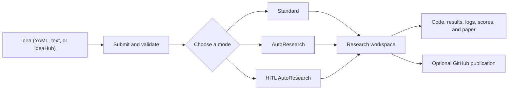

<div align="center">


[](https://github.com/ChicagoHAI/neurico)
[](https://www.python.org/downloads/)
[](docker/)
[](LICENSE)
[](https://x.com/ChicagoHAI)
[](https://discord.gg/n65caV7NhC)

</div>

<!-- agent-summary: NeuriCo is an autonomous and human-in-the-loop research framework. Input: YAML, Markdown/text, or IdeaHub. Modes: Standard, AutoResearch, and HITL AutoResearch. Outputs: code, results, logs, scores, and an optional paper. Providers: Claude Code, Codex, Gemini. Installation: Docker or local uv. License: Apache 2.0. -->

**NeuriCo** (**Neur**al **Co**-Scientist, inspired by Enrico Fermi) takes
structured research ideas and coordinates agents to find resources, design and
run experiments, analyze results, and document the work.

<div align="center">

</div>

## Key features

| Feature | Description |
| --- | --- |
| **Minimal Input** | Provide a title, domain, and hypothesis; agents handle the research workflow |
| **Agent-Driven Research** | Finds literature, datasets, and baselines before running experiments |
| **Multi-Provider Support** | Works with Claude Code, Codex, and Gemini CLI |
| **AutoResearch** | Iteratively proposes, executes, scores, and checkpoints improvements |
| **HITL AutoResearch** | Adds a manager and human decision points to AutoResearch |
| **Domain-Agnostic** | Supports ML, data science, AI, systems, theory, and more |
| **Smart Documentation** | Produces reports, code, results, and optional papers |
| **GitHub Integration** | Optionally creates repositories and pushes results |

## Requirements

**Minimal** (choose one):

- **Docker:** [Git](https://git-scm.com/) and a running [Docker](https://docs.docker.com/get-docker/) installation
- **Local `uv`:** Git, Python 3.10+, and [`uv`](https://docs.astral.sh/uv/getting-started/installation/)

**Provider access:**

- [Claude Code](https://docs.anthropic.com/en/docs/claude-code), [Codex](https://github.com/openai/codex), or [Gemini CLI](https://github.com/google-gemini/gemini-cli)
- Provider login uses OAuth; provider API keys are not required

**Recommended for GitHub publishing:**

- A classic GitHub token with `repo` scope; [create one](https://github.com/settings/tokens/new) and set `GITHUB_TOKEN` in `.env`
- Skip this when research should remain local

## Quick start

Choose Docker or local `uv` and use the same route throughout.

### 1. Install

#### Docker

```bash
git clone https://github.com/ChicagoHAI/neurico.git
cd neurico
./neurico setup --quick
```

For Codex or Gemini, run `./neurico setup` instead.

#### Local `uv` (native)

```bash
git clone https://github.com/ChicagoHAI/neurico.git
cd neurico
uv sync
cp .env.example .env
claude  # or: codex, gemini
```

### 2. Write and submit an idea

Create a YAML idea file:

```yaml
idea:
  title: "Do LLMs distinguish causation from correlation?"
  domain: artificial_intelligence
  hypothesis: >
    Explicit causal prompts improve causal-reasoning accuracy compared with
    otherwise equivalent direct prompts.
```

Submit it and keep the printed `<idea_id>`:

| Docker | Local `uv` (native) |
| --- | --- |
| `./neurico submit path/to/idea.yaml` | `uv run python src/cli/submit.py path/to/idea.yaml` |

### 3. Choose a research mode

Replace `<idea_id>` with the ID printed during submission.

| Mode | Docker | Local `uv` (native) | Behavior |
| --- | --- | --- | --- |
| **[Standard](#standard)** | `./neurico run <idea_id>` | `uv run python src/core/runner.py <idea_id>` | Run the research pipeline once |
| **[AutoResearch](#autoresearch)** | `./neurico run <idea_id> --autoresearch` | `uv run python src/core/runner.py <idea_id> --autoresearch` | Build a scored baseline and try one improvement |
| **[HITL AutoResearch](#hitl-autoresearch) — web** | `./neurico hitl-web <idea_id>` | `uv run python src/cli/hitl_web.py <idea_id>` | Manage research in the browser |
| **[HITL AutoResearch](#hitl-autoresearch) — terminal** | `./neurico hitl-cli <idea_id>` | `uv run python src/cli/hitl_cli.py <idea_id>` | Manage research in the terminal |

That's it—NeuriCo turns your hypothesis into experiments, evidence, and a
reproducible research project.

## Configuration

A basic run needs no additional configuration.

- **Docker:** run `./neurico config`
- **Local `uv`:** edit `.env`; set the workspace location in `config/workspace.yaml`

### Optional integrations

| Key | Enables |
| --- | --- |
| `OPENROUTER_KEY` or `OPENAI_API_KEY` | LLM-assisted idea conversion, repository naming, and paper-finder |
| `S2_API_KEY` | Semantic Scholar search through paper-finder |
| `COHERE_API_KEY` | Optional paper-finder reranking |
| `ANTHROPIC_API_KEY` | Direct Anthropic API access in experiments |
| `GOOGLE_API_KEY` | Direct Google AI API access in experiments |
| `HF_TOKEN` | Private Hugging Face models and datasets |
| `WANDB_API_KEY` | Weights & Biases experiment tracking |

Paper-finder requires `S2_API_KEY` and either `OPENROUTER_KEY` or
`OPENAI_API_KEY`. See the [paper-finder guide](config/paper_finder.md).

## Writing and submitting ideas

### Start with a minimal idea

Create a YAML file under `ideas/`, for example `ideas/my_idea.yaml`:

```yaml
idea:
  title: "Do LLMs distinguish causation from correlation?"
  domain: artificial_intelligence
  hypothesis: >
    Explicit causal prompts improve causal-reasoning accuracy compared with
    otherwise equivalent direct prompts.
```

This is a complete idea. The `ideas/` directory is recommended, but submission
also accepts relative or absolute paths elsewhere. The three required fields
are:

- `title` — a short description of the research question
- `domain` — the NeuriCo domain that should guide the research
- `hypothesis` — the claim the experiment should test

### Choose a domain

Use the closest domain key for the methods and evaluation the research will
use:

| Domain key | Use for |
| --- | --- |
| `artificial_intelligence` | LLM evaluation, prompting, agents, and AI benchmarks |
| `machine_learning` | Model training, prediction, clustering, and evaluation |
| `data_science` | Statistical analysis, forecasting, and visualization |
| `systems` | Performance, databases, networks, compilers, and distributed systems |
| `mathematics` | Pure or applied mathematics and human-written proofs |

These are common choices, not the complete list. See
[`config/domains.yaml`](config/domains.yaml) for all supported domain keys and
the [Idea guide](docs/IDEA_GUIDE.md) for selection guidance.

### Write a testable hypothesis

The hypothesis should name what is being compared and what evidence will be
measured. It must be possible for the result to support, contradict, or qualify
the claim.

Avoid a task description:

```yaml
hypothesis: "Study whether LLMs understand causality."
```

Write a claim that can be tested:

```yaml
hypothesis: >
  Explicit causal prompts improve causal-reasoning accuracy compared with
  otherwise equivalent direct prompts.
```

### Add details when they matter

Leave optional sections out when NeuriCo should choose the papers, datasets,
methods, baselines, metrics, or outputs. Add them when they record a known
resource or a requirement that the run must preserve.

For example, a complete idea with hard execution and evaluation rules is:

```yaml
idea:
  title: "Do LLMs distinguish causation from correlation?"
  domain: artificial_intelligence
  hypothesis: >
    Explicit causal prompts improve causal-reasoning accuracy compared with
    otherwise equivalent direct prompts.

  constraints:
    compute: cpu_only
    time_limit: 3600

  evaluation_criteria:
    - "Evaluate both prompt types on the same examples."
    - "Save per-example predictions and aggregate accuracy."
```

Use `background` for known papers, datasets, or code; `methodology` for a
required approach; `local_resources` for files or functions on the host;
`evaluation` or `evaluation_criteria` for fixed evaluation rules; and
`expected_outputs` for required deliverables.

The [Idea quickstart](docs/IDEA_QUICKSTART.md) provides a first-idea checklist.
The complete [Idea guide](docs/IDEA_GUIDE.md) documents every field. The
authoritative schema and additional examples are under
[`ideas/schema.yaml`](ideas/schema.yaml) and [`ideas/examples/`](ideas/examples/).

### Submit YAML

| Docker | Local `uv` (native) |
| --- | --- |
| `./neurico submit <idea.yaml>` | `uv run python src/cli/submit.py <idea.yaml>` |

Common submission options:

| Flag | Purpose |
| --- | --- |
| `--no-validate` | Skip schema validation; intended for development and diagnosis |
| `--no-github` | Disable repository creation for this submission |
| `--github-org ORG` | Create the repository in a GitHub organization |
| `--private` | Create a private repository |
| `--no-hash` | Omit the random hash from the generated repository name |

If `GITHUB_TOKEN` is set, submission also creates and prepares a research
repository. Otherwise, the idea remains local.

### Submit Markdown or text

Use `submit-local` for Markdown or text ideas, or when the idea refers to local
datasets and functions:

| Docker | Local `uv` (native) |
| --- | --- |
| `./neurico submit-local idea.md` | `uv run python src/cli/submit_local.py idea.md` |

The command creates a YAML draft under `ideas/`. Add `--submit` to submit it,
or `--submit --run` to submit it and start a Standard run. Declared local
resources are mounted read-only during research. Without `OPENROUTER_KEY` or
`OPENAI_API_KEY`, NeuriCo uses template-based conversion; declare local paths
in `local_resources` by hand. See
[Local idea submission](docs/LOCAL_IDEA_SUBMISSION.md).

### Import from IdeaHub

Fetch and convert an [IdeaHub](https://hypogenic.ai/ideahub) page:

| Docker | Local `uv` (native) |
| --- | --- |
| `./neurico fetch <ideahub_url>` | `uv run python src/cli/fetch_from_ideahub.py <ideahub_url>` |

The command creates a YAML draft. Add `--submit` to submit it, or
`--submit --run` to submit it and start a Standard run. See the
[IdeaHub guide](docs/IDEAHUB_INTEGRATION.md).

IdeaHub works without an API key using template-based conversion. Set
`OPENROUTER_KEY` or `OPENAI_API_KEY` in `.env` for LLM-assisted conversion.

## Research modes

### Standard

Standard runs the research pipeline once: resource discovery, experiment
design, execution, analysis, and paper writing.

| Docker | Local `uv` (native) |
| --- | --- |
| `./neurico run <idea_id>` | `uv run python src/core/runner.py <idea_id>` |

The default provider is Claude, the default compute backend is local, and full
provider permissions and paper writing are enabled.

#### Common options

| Flag | Default | Purpose |
| --- | --- | --- |
| `--provider claude\|codex\|gemini` | `claude` | Select the research worker provider |
| `--compute-backend local\|dsi-slurm\|modal` | `local` | Select where experiments execute |
| `--timeout SECONDS` | `3600` | Set the experiment-runner timeout |
| `--no-full-permissions` | full permissions | Restore normal provider permission prompts |
| `--no-write-paper` | paper enabled | Skip paper generation |
| `--paper-style neurips\|icml\|acl\|ams` | domain default | Select the paper template |
| `--no-github` | GitHub when configured | Keep the run local |
| `--force-fresh` | reuse workspace | Ignore an existing workspace and start again |

Modal runs require `modal token new` on the host; Docker mounts
`~/.modal.toml` into the container. The `dsi-slurm` backend requires University
of Chicago DSI cluster access and a working `login.ds` SSH alias.

<details>
<summary>Advanced Standard pipeline controls</summary>

| Flag | Purpose |
| --- | --- |
| `--pause-after-resources` | Review resources before experimentation |
| `--skip-resource-finder` | Use an already prepared workspace |
| `--resource-finder-timeout SECONDS` | Change the resource-finder timeout; default `2700` |
| `--use-scribe` | Use the optional notebook-oriented execution path |
| `--enable-scoring` | Add a sealed rule-maker and scorer stage |
| `--comment-mode` | Apply targeted changes from comments in the submitted idea |

</details>

### AutoResearch

AutoResearch keeps the best scored checkpoint. Each iteration proposes one
change, runs it, scores it, and keeps it if the score improves.

#### Start fresh

| Docker | Local `uv` (native) |
| --- | --- |
| `./neurico run <idea_id> --autoresearch` | `uv run python src/core/runner.py <idea_id> --autoresearch` |

This runs the scored pipeline, saves the initial checkpoint, and performs one
improvement iteration.

#### Continue an existing AutoResearch workspace

| Docker | Local `uv` (native) |
| --- | --- |
| `./neurico run <idea_id> --continue-autoresearch` | `uv run python src/core/runner.py <idea_id> --continue-autoresearch` |

Continuation resumes an existing scored workspace and skips the earlier
research stages.

#### Bootstrap a Standard workspace

| Docker | Local `uv` (native) |
| --- | --- |
| `./neurico run <idea_id> --bootstrap-autoresearch-baseline` | `uv run python src/core/runner.py <idea_id> --bootstrap-autoresearch-baseline` |

Bootstrap scores an existing Standard workspace and creates the AutoResearch
continuation state. It does not run an improvement iteration. Continue with
`--continue-autoresearch`.

#### Iterations

AutoResearch runs one improvement iteration by default. Use
`--autoresearch-iterations N` to run more than one.

Fresh, continue, and bootstrap are mutually exclusive. Standard provider,
compute, permission, paper, and GitHub options also apply.

<details>
<summary>Advanced AutoResearch and bootstrap controls</summary>

| Flag | Default | Purpose |
| --- | --- | --- |
| `--proposer-timeout SECONDS` | `900` | Set proposal-generation timeout |
| `--rule-maker-timeout SECONDS` | `1800` | Set scoring-contract construction timeout |
| `--scorer-timeout SECONDS` | `600` | Set scoring timeout |
| `--manifest-trimmer-timeout SECONDS` | `300` | Set bootstrap manifest-trimmer timeout |
| `--bootstrap-rule-maker` | off | Retrofit scoring without creating AutoResearch continuation state |

</details>

See the [AutoResearch guide](docs/AUTORESEARCH.md) for checkpoint, scoring, and
recovery behavior.

### HITL AutoResearch

HITL AutoResearch adds a persistent manager conversation, human decision
points, isolated scoring, and a retained research frontier. The web and
terminal interfaces share the same workspace state.

#### Web interface

| Docker | Local `uv` (native) |
| --- | --- |
| `./neurico hitl-web <idea_id>` | `uv run python src/cli/hitl_web.py <idea_id>` |

The web interface opens at `http://localhost:7890`. Docker binds it to
`127.0.0.1`. Use `--port N` to choose another port or `--no-browser` to start
the server without opening a browser. To begin research, open **Start
AutoResearch**, choose the run settings, and start the fresh or continuing run.

#### Terminal interface

| Docker | Local `uv` (native) |
| --- | --- |
| `./neurico hitl-cli <idea_id>` | `uv run python src/cli/hitl_cli.py <idea_id>` |

Opening the terminal interface does not start research. Enter `/run` to
configure and start it. The terminal commands are:

| Control | Purpose |
| --- | --- |
| `/run` | Configure and start a fresh or continuing HITL run |
| `/reply <number>` | Choose an option for the active human request |
| `/reply <feedback>` | Resolve a request with free-form feedback |
| `/help` | Show interface commands |
| `/quit` | Close the terminal interface |

See the [HITL AutoResearch guide](docs/HITL_AUTORESEARCH.md) for the manager,
human requests, scoring frontier, and recovery model.

## Other Docker commands

```bash
./neurico config   # Configure API keys and settings
./neurico shell    # Open a shell in the container
./neurico login    # Open the provider login shell
./neurico help     # Show all commands
```

## Outputs and architecture

A research workspace can contain:

```text
workspaces/<research-workspace>/
├── README.md
├── REPORT.md
├── STATE.md
├── src/
├── results/
├── logs/
├── artifacts/
├── scoring/
└── paper_draft/
```

Ideas move through `ideas/submitted/`, `ideas/in_progress/`, and
`ideas/completed/`. Workspace contents depend on the mode and run options.

<details>
<summary>System architecture</summary>



</details>

## Customizing NeuriCo

Most users do not need to change the built-in templates. Edit them when a
research workflow needs different agent instructions, paper structure,
resource-finding behavior, or domain guidance. Docker mounts templates from the
repository, so changes do not require an image rebuild.

| Behavior | File or directory |
| --- | --- |
| Experiment workflow | `templates/agents/session_instructions.txt` |
| Paper writing | `templates/agents/paper_writer.txt` |
| Resource discovery | `templates/agents/resource_finder.txt` |
| Base research method | `templates/base/researcher.txt` |
| Domain guidance | `templates/domains/<domain>/core.txt` |
| Provider skills | `templates/skills/<skill-name>/SKILL.md` |

See [`templates/README.md`](templates/README.md) for the template system.

## Documentation

| Guide | What it covers |
| --- | --- |
| [Workflow](docs/WORKFLOW.md) | Complete Docker and local `uv` workflow |
| [Idea quickstart](docs/IDEA_QUICKSTART.md) | Write and submit a first idea |
| [Idea guide](docs/IDEA_GUIDE.md) | Full idea schema, fields, and examples |
| [AutoResearch](docs/AUTORESEARCH.md) | Fresh runs, continuation, recovery, and bootstrap |
| [HITL AutoResearch](docs/HITL_AUTORESEARCH.md) | Manager workflow, interfaces, frontier, and recovery |
| [Local files](docs/LOCAL_IDEA_SUBMISSION.md) | Markdown ideas, local datasets, functions, and evaluators |
| [IdeaHub](docs/IDEAHUB_INTEGRATION.md) | Import ideas from IdeaHub |
| [GitHub integration](docs/GITHUB_INTEGRATION.md) | Optional repository creation and publishing |
| [ClawHub skill](clawskill/SKILL.md) | ClawHub discovery and onboarding package |

ClawHub provides installation and onboarding metadata. Run NeuriCo with Docker
or local `uv`. The [documentation index](docs/README.md) separates user guides
from developer, internal, and legacy documents.

## Contributing

Contributions are welcome. Areas of interest include domain templates,
evaluation contracts, experiment integrations, and research-mode improvements.
Open an issue before starting a large change.

## Citation

If you use NeuriCo in research, please cite:

```bibtex
@software{neurico_2025,
  title={NeuriCo: Autonomous Research Framework},
  author={Haokun Liu, Chenhao Tan},
  year={2025},
  url={https://github.com/ChicagoHAI/neurico}
}
```

## Acknowledgments

Some skills in `templates/skills/` were inspired by
[claude-scientific-skills](https://github.com/K-Dense-AI/claude-scientific-skills)
(MIT License, K-Dense Inc.). See [`NOTICE`](NOTICE) for details.

## License

Apache 2.0. See [`LICENSE`](LICENSE).

For questions and feedback, [open an issue](https://github.com/ChicagoHAI/neurico/issues)
or join the [NeuriCo Discord](https://discord.gg/BgkfTvBdbV).
