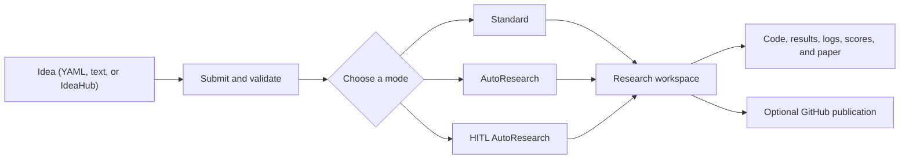

<div align="center">


[](https://github.com/ChicagoHAI/neurico)
[](https://www.python.org/downloads/)
[](docker/)
[](LICENSE)
[](https://x.com/ChicagoHAI)
[](https://discord.gg/n65caV7NhC)

</div>

<!-- agent-summary: NeuriCo is an autonomous and human-in-the-loop research framework. Input: YAML, Markdown/text, or IdeaHub. Modes: Standard, AutoResearch, and HITL AutoResearch. Outputs: code, results, logs, scores, and an optional paper. Providers: Claude Code, Codex, Gemini. Installation: Docker or local uv. License: Apache 2.0. -->

**NeuriCo** (**Neur**al **Co**-Scientist, inspired by Enrico Fermi) takes
structured research ideas and coordinates agents to find resources, design and
run experiments, analyze results, and document the work.

<div align="center">

</div>

## Key features

| Feature | Description |
| --- | --- |
| **Minimal input** | Start with a title, research domain, and testable hypothesis |
| **Research pipeline** | Resource discovery, experiment design, execution, analysis, and paper writing |
| **Three research modes** | Standard, iterative AutoResearch, and human-in-the-loop AutoResearch |
| **Multiple providers** | Claude Code, Codex, and Gemini CLI |
| **Reproducible workspaces** | Code, results, logs, artifacts, scoring state, and reports stay together |
| **Domain support** | Built-in guidance for AI, ML, mathematics, finance, scientific computing, and more |
| **Optional integrations** | GitHub publishing, IdeaHub import, paper-finder, Hugging Face, and W&B |

## Requirements

Choose either Docker or local `uv`:

- **Docker:** [Git](https://git-scm.com/) and a running
  [Docker](https://docs.docker.com/get-docker/) installation.
- **Local `uv`:** Git, Python 3.10+, and
  [`uv`](https://docs.astral.sh/uv/getting-started/installation/).

Both routes require at least one provider CLI:
[Claude Code](https://docs.anthropic.com/en/docs/claude-code),
[Codex](https://github.com/openai/codex), or
[Gemini CLI](https://github.com/google-gemini/gemini-cli). Provider CLIs use
their own OAuth login; provider API keys are not required for the basic
workflow.

GitHub, paper-finder, model-service, and experiment-tracking credentials are
optional. A GPU is only needed for experiments that require one.

## Quick start

Install NeuriCo, submit an idea, then choose a research mode. Docker and local
`uv` support the same workflow; use the commands for the route you installed.

### 1. Install

#### Docker

```bash
git clone https://github.com/ChicagoHAI/neurico.git
cd neurico
./neurico setup
```

The setup wizard pulls the image, creates the configuration files, and handles
provider login.

<details>
<summary>Alternative Docker setup, GPU support, and maintenance</summary>

Run quick setup directly:

```bash
./neurico setup --quick
```

Or use the one-line installer:

```bash
curl -fsSL https://raw.githubusercontent.com/ChicagoHAI/neurico/main/install.sh | bash
```

To manage the image manually:

```bash
# Pull the prebuilt image
docker pull ghcr.io/chicagohai/neurico:latest
docker tag ghcr.io/chicagohai/neurico:latest chicagohai/neurico:latest

# Or build from the current checkout
./neurico build
```

The repository is required with either image option. It provides the
`./neurico` launcher, configuration, templates, ideas, and workspace mounts.

NVIDIA GPU passthrough requires the
[NVIDIA Container Toolkit](https://docs.nvidia.com/datacenter/cloud-native/container-toolkit/latest/install-guide.html).
CPU-only execution remains available.

Useful Docker commands:

```bash
./neurico config   # Edit settings and optional integrations
./neurico login    # Repeat provider login
./neurico update   # Update the checkout and image
./neurico shell    # Open a shell in the container
./neurico help     # List available commands
```

</details>

#### Local `uv`

Install one provider CLI on the host, then:

```bash
git clone https://github.com/ChicagoHAI/neurico.git
cd neurico
uv sync
cp .env.example .env
claude  # or: codex, gemini
```

The last command starts provider OAuth login. Local `uv` uses the same ideas,
configuration, templates, and workspace layout as Docker.

### 2. Submit an idea

Create `ideas/my_idea.yaml`:

```yaml
idea:
  title: "Do LLMs distinguish causation from correlation?"
  domain: artificial_intelligence
  hypothesis: >
    Explicit causal prompts improve causal-reasoning accuracy compared with
    otherwise equivalent direct prompts.
```

Submit it:

| Docker | Local `uv` |
| --- | --- |
| `./neurico submit ideas/my_idea.yaml` | `uv run python src/cli/submit.py ideas/my_idea.yaml` |

Submission validates the idea and prints an `<idea_id>`. Research does not
start until you run the idea. Both routes accept relative and absolute paths.

### 3. Choose a research mode

Replace `<idea_id>` with the ID printed during submission.

| Mode | Docker | Local `uv` | Behavior |
| --- | --- | --- | --- |
| **Standard** | `./neurico run <idea_id>` | `uv run python src/core/runner.py <idea_id>` | Run the research pipeline once |
| **AutoResearch** | `./neurico run <idea_id> --autoresearch` | `uv run python src/core/runner.py <idea_id> --autoresearch` | Build a scored baseline and try one improvement |
| **HITL AutoResearch** | `./neurico hitl-web <idea_id>` | `uv run python src/cli/hitl_web.py <idea_id>` | Open the manager; start research with `/run` |

## Idea submission

A minimal idea needs a title, domain, and testable hypothesis. Agents can find
datasets and literature, choose baselines and metrics, and design the
experiment. Add optional fields when the run must use a specific method,
resource, or evaluation rule.

| Section | Purpose |
| --- | --- |
| `background` | Context, papers, datasets, and code references |
| `methodology` | Required approach, steps, baselines, or metrics |
| `constraints` | Compute, time, memory, or budget limits |
| `local_resources` | Host datasets or Python functions to stage into the workspace |
| `evaluation` | Metrics, targets, and evaluator functions |
| `evaluation_criteria` | Free-form validity or reproducibility requirements |
| `expected_outputs` | Artifacts the completed research should produce |

See the [Idea quickstart](docs/IDEA_QUICKSTART.md), complete
[Idea guide](docs/IDEA_GUIDE.md), [`ideas/schema.yaml`](ideas/schema.yaml), and
[`ideas/examples/`](ideas/examples/).

### YAML submission options

| Flag | Purpose |
| --- | --- |
| `--no-validate` | Skip schema validation; intended for development and diagnosis |
| `--no-github` | Disable repository creation for this submission |
| `--github-org ORG` | Create the repository in a GitHub organization |
| `--private` | Create a private repository |
| `--no-hash` | Omit the random hash from the generated repository name |

If `GITHUB_TOKEN` is set, submission also creates and prepares a research
repository. Otherwise, the idea remains local.

### Markdown or text

Use `submit-local` for Markdown or text ideas, or when the idea refers to local
datasets and functions:

| Docker | Local `uv` |
| --- | --- |
| `./neurico submit-local idea.md` | `uv run python src/cli/submit_local.py idea.md` |

The command creates a YAML draft under `ideas/`. Add `--submit` to submit it,
or `--submit --run` to submit it and start a Standard run. Declared local
resources are mounted read-only during research. See
[Local idea submission](docs/LOCAL_IDEA_SUBMISSION.md).

### IdeaHub

Fetch and convert an [IdeaHub](https://hypogenic.ai/ideahub) page:

| Docker | Local `uv` |
| --- | --- |
| `./neurico fetch <ideahub_url>` | `uv run python src/cli/fetch_from_ideahub.py <ideahub_url>` |

The command creates a YAML draft. Add `--submit` to submit it, or
`--submit --run` to submit it and start a Standard run. See the
[IdeaHub guide](docs/IDEAHUB_INTEGRATION.md).

## Research modes

### Standard

Standard runs the research pipeline once: resource discovery, experiment
design, execution, analysis, and paper writing.

| Docker | Local `uv` |
| --- | --- |
| `./neurico run <idea_id>` | `uv run python src/core/runner.py <idea_id>` |

The default provider is Claude, the default compute backend is local, and full
provider permissions and paper writing are enabled.

#### Common options

| Flag | Default | Purpose |
| --- | --- | --- |
| `--provider claude\|codex\|gemini` | `claude` | Select the research worker provider |
| `--compute-backend local\|dsi-slurm\|modal` | `local` | Select where experiments execute |
| `--timeout SECONDS` | `3600` | Set the experiment-runner timeout |
| `--no-full-permissions` | full permissions | Restore normal provider permission prompts |
| `--no-write-paper` | paper enabled | Skip paper generation |
| `--paper-style neurips\|icml\|acl\|ams` | domain default | Select the paper template |
| `--no-github` | GitHub when configured | Keep the run local |
| `--force-fresh` | reuse workspace | Ignore an existing workspace and start again |

<details>
<summary>Advanced Standard pipeline controls</summary>

| Flag | Purpose |
| --- | --- |
| `--pause-after-resources` | Review resources before experimentation |
| `--skip-resource-finder` | Use an already prepared workspace |
| `--resource-finder-timeout SECONDS` | Change the resource-finder timeout; default `2700` |
| `--use-scribe` | Use the optional notebook-oriented execution path |
| `--enable-scoring` | Add a sealed rule-maker and scorer stage |
| `--comment-mode` | Apply targeted changes from comments in the submitted idea |

</details>

### AutoResearch

AutoResearch keeps the best scored checkpoint. Each iteration proposes one
change, runs it, scores it, and keeps it if the score improves.

#### Start fresh

| Docker | Local `uv` |
| --- | --- |
| `./neurico run <idea_id> --autoresearch` | `uv run python src/core/runner.py <idea_id> --autoresearch` |

This runs the scored pipeline, saves the initial checkpoint, and performs one
improvement iteration.

#### Continue an existing AutoResearch workspace

| Docker | Local `uv` |
| --- | --- |
| `./neurico run <idea_id> --continue-autoresearch` | `uv run python src/core/runner.py <idea_id> --continue-autoresearch` |

Continuation resumes an existing scored workspace and skips the earlier
research stages.

#### Bootstrap a Standard workspace

| Docker | Local `uv` |
| --- | --- |
| `./neurico run <idea_id> --bootstrap-autoresearch-baseline` | `uv run python src/core/runner.py <idea_id> --bootstrap-autoresearch-baseline` |

Bootstrap scores an existing Standard workspace and creates the AutoResearch
continuation state. It does not run an improvement iteration. Continue with
`--continue-autoresearch`.

#### Common options

| Flag | Default | Purpose |
| --- | --- | --- |
| `--autoresearch-iterations N` | `1` | Set the number of improvement iterations |
| `--continue-recover` | off | Restore the best checkpoint after an interrupted dirty attempt |
| `--autoresearch-history-dir PATH` | workspace logs | Change attempt-history storage |

Fresh, continue, and bootstrap are mutually exclusive. Standard provider,
compute, permission, paper, and GitHub options also apply.

<details>
<summary>Advanced AutoResearch and bootstrap controls</summary>

| Flag | Default | Purpose |
| --- | --- | --- |
| `--proposer-timeout SECONDS` | `900` | Set proposal-generation timeout |
| `--rule-maker-timeout SECONDS` | `1800` | Set scoring-contract construction timeout |
| `--scorer-timeout SECONDS` | `600` | Set scoring timeout |
| `--manifest-trimmer-timeout SECONDS` | `300` | Set bootstrap manifest-trimmer timeout |
| `--bootstrap-rule-maker` | off | Retrofit scoring without creating AutoResearch continuation state |

</details>

See the [AutoResearch guide](docs/AUTORESEARCH.md) for checkpoint, scoring, and
recovery behavior.

### HITL AutoResearch

HITL AutoResearch adds a persistent manager conversation, human decision
points, isolated scoring, and a retained research frontier. The web and
terminal interfaces share the same workspace state.

#### Web interface

| Docker | Local `uv` |
| --- | --- |
| `./neurico hitl-web <idea_id>` | `uv run python src/cli/hitl_web.py <idea_id>` |

The web interface opens at `http://localhost:7890`. Docker binds it to
`127.0.0.1`. Use `--port N` to choose another port or `--no-browser` to start
the server without opening a browser.

#### Terminal interface

| Docker | Local `uv` |
| --- | --- |
| `./neurico hitl-cli <idea_id>` | `uv run python src/cli/hitl_cli.py <idea_id>` |

Opening an interface does not start research. Use these manager commands:

| Control | Purpose |
| --- | --- |
| `/run` | Configure and start a fresh or continuing HITL run |
| `/reply <number>` | Choose an option for the active human request |
| `/reply <feedback>` | Resolve a request with free-form feedback |
| `/help` | Show interface commands |
| `/quit` | Close the terminal interface |

See the [HITL AutoResearch guide](docs/HITL_AUTORESEARCH.md) for the manager,
human requests, scoring frontier, and recovery model.

## Configuration

### Provider authentication

Claude Code, Codex, and Gemini use OAuth login. Docker mounts host credentials
into the container. Local `uv` uses the provider login on the host.

### Environment variables

Docker users can run `./neurico config`. Both routes can also edit `.env`
directly. These variables enable optional integrations:

| Variable | Purpose |
| --- | --- |
| `GITHUB_TOKEN` | Create and publish research repositories |
| `GITHUB_ORG` | Default GitHub organization |
| `OPENAI_API_KEY` | IdeaHub conversion, repository naming, and paper-finder |
| `S2_API_KEY` | Semantic Scholar literature search |
| `COHERE_API_KEY` | Paper-finder reranking |
| `ANTHROPIC_API_KEY` | Optional Claude API access during experiments |
| `GOOGLE_API_KEY` | Optional Google AI API access during experiments |
| `OPENROUTER_KEY` | OpenRouter access during experiments and paper-finder |
| `HF_TOKEN` | Private Hugging Face models or datasets |
| `WANDB_API_KEY` | Weights & Biases tracking |

See the [GitHub integration guide](docs/GITHUB_INTEGRATION.md) for repository
creation and publishing.

<details>
<summary>Paper-finder integration</summary>

Paper-finder requires `S2_API_KEY` and either `OPENAI_API_KEY` or
`OPENROUTER_KEY`. `COHERE_API_KEY` enables additional reranking. Without these
keys, agents use their normal literature-search tools. Docker starts the
service automatically when the required keys are set.

See [`config/paper_finder.md`](config/paper_finder.md) for configuration and
troubleshooting.

</details>

### Workspace configuration

Workspaces default to `workspaces/`. To use another location, copy
`config/workspace.yaml.example` to `config/workspace.yaml` and set
`parent_dir`:

```yaml
workspace:
  parent_dir: "/path/to/your/workspaces"
  auto_create: true
```

Docker mounts that directory at `/workspaces`; local `uv` uses it directly.

### Customizing templates and skills

Files under `templates/` control agent instructions. Docker mounts them from
the repository, so changes do not require an image rebuild.

| Behavior | File or directory |
| --- | --- |
| Experiment workflow | `templates/agents/session_instructions.txt` |
| Paper writing | `templates/agents/paper_writer.txt` |
| Resource discovery | `templates/agents/resource_finder.txt` |
| Base research method | `templates/base/researcher.txt` |
| Domain guidance | `templates/domains/<domain>/core.txt` |
| Provider skills | `templates/skills/<skill-name>/SKILL.md` |

See [`templates/README.md`](templates/README.md) for the template system.

## Outputs and architecture

A research workspace can contain:

```text
workspaces/<research-workspace>/
├── README.md
├── REPORT.md
├── STATE.md
├── src/
├── results/
├── logs/
├── artifacts/
├── scoring/
└── paper_draft/
```

Ideas move through `ideas/submitted/`, `ideas/in_progress/`, and
`ideas/completed/`. Workspace contents depend on the mode and run options.

<details>
<summary>System architecture</summary>



</details>

## Supported domains

| Domain | Examples |
| --- | --- |
| Artificial intelligence | LLM evaluation, prompting, agents, benchmarking |
| Machine learning | Training, evaluation, and hyperparameter studies |
| Data science | Statistical analysis and visualization |
| Systems | Performance benchmarking and optimization |
| Theory | Algorithmic analysis and formal methods |
| Mathematics | Pure and applied mathematics |
| Mathematics (Lean) | Machine-checked Lean 4 proofs |
| Finance | Empirical finance and panel-data analysis |
| Battery research | Electrochemical energy storage |
| Scientific computing | Simulation and numerical methods |
| Particle physics | Testable beyond-the-Standard-Model studies |
| NLP | Language-model and text experiments |
| Computer vision | Image processing and detection |
| Reinforcement learning | Policy training and evaluation |

Domain definitions live in [`config/domains.yaml`](config/domains.yaml).

## Documentation

| Guide | What it covers |
| --- | --- |
| [Workflow](docs/WORKFLOW.md) | Complete Docker and local `uv` workflow |
| [Idea quickstart](docs/IDEA_QUICKSTART.md) | Write and submit a first idea |
| [Idea guide](docs/IDEA_GUIDE.md) | Full idea schema, fields, and examples |
| [AutoResearch](docs/AUTORESEARCH.md) | Fresh runs, continuation, recovery, and bootstrap |
| [HITL AutoResearch](docs/HITL_AUTORESEARCH.md) | Manager workflow, interfaces, frontier, and recovery |
| [Local files](docs/LOCAL_IDEA_SUBMISSION.md) | Markdown ideas, local datasets, functions, and evaluators |
| [IdeaHub](docs/IDEAHUB_INTEGRATION.md) | Import ideas from IdeaHub |
| [GitHub integration](docs/GITHUB_INTEGRATION.md) | Optional repository creation and publishing |
| [ClawHub skill](clawskill/SKILL.md) | ClawHub discovery and onboarding package |

ClawHub provides installation and onboarding metadata. Run NeuriCo with Docker
or local `uv`. The [documentation index](docs/README.md) separates user guides
from developer, internal, and legacy documents.

## Contributing

Contributions are welcome. Areas of interest include domain templates,
evaluation contracts, experiment integrations, and research-mode improvements.
Open an issue before starting a large change.

## Citation

If you use NeuriCo in research, please cite:

```bibtex
@software{neurico_2025,
  title={NeuriCo: Autonomous Research Framework},
  author={Haokun Liu, Chenhao Tan},
  year={2025},
  url={https://github.com/ChicagoHAI/neurico}
}
```

## Acknowledgments

Some skills in `templates/skills/` were inspired by
[claude-scientific-skills](https://github.com/K-Dense-AI/claude-scientific-skills)
(MIT License, K-Dense Inc.). See [`NOTICE`](NOTICE) for details.

## License

Apache 2.0. See [`LICENSE`](LICENSE).

For questions and feedback, [open an issue](https://github.com/ChicagoHAI/neurico/issues)
or join the [NeuriCo Discord](https://discord.gg/BgkfTvBdbV).
