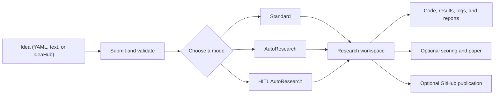

<div align="center">


[](https://github.com/ChicagoHAI/neurico)
[](https://www.python.org/downloads/)
[](docker/)
[](LICENSE)
[](https://x.com/ChicagoHAI)
[](https://discord.gg/n65caV7NhC)

</div>

<!-- agent-summary: NeuriCo is an autonomous and human-in-the-loop research framework. Input: YAML, Markdown/text, or IdeaHub. Modes: Standard, AutoResearch, and HITL AutoResearch. Outputs: code, results, logs, scores, and an optional paper. Providers: Claude Code, Codex, Gemini. Installation: Docker or local uv. License: Apache 2.0. -->

**NeuriCo** (**Neur**al **Co**-Scientist, inspired by Enrico Fermi) takes
structured research ideas and coordinates agents to find resources, design and
run experiments, analyze results, and document the work.

<div align="center">

</div>

## Key features

| Feature | Description |
| --- | --- |
| **Minimal Input** | Provide a title, domain, and hypothesis; agents handle the research workflow |
| **Agent-Driven Research** | Finds literature, datasets, and baselines before running experiments |
| **Multi-Provider Support** | Works with Claude Code, Codex, and Gemini CLI |
| **AutoResearch** | Iteratively proposes, executes, scores, and checkpoints improvements |
| **HITL AutoResearch** | Adds a manager and human decision points to AutoResearch |
| **Domain-Agnostic** | Supports ML, data science, AI, systems, theory, and more |
| **Smart Documentation** | Produces reports, code, results, and optional papers |
| **GitHub Integration** | Optionally creates repositories and pushes results |

## Requirements

**Minimal** (choose one):

- **Docker:** [Git](https://git-scm.com/) and a running [Docker](https://docs.docker.com/get-docker/) installation
- **Local `uv`:** Git, Python 3.10+, and [`uv`](https://docs.astral.sh/uv/getting-started/installation/)

**Provider access:**

- [Claude Code](https://docs.anthropic.com/en/docs/claude-code), [Codex](https://github.com/openai/codex), or [Gemini CLI](https://github.com/google-gemini/gemini-cli)
- Provider login uses OAuth; provider API keys are not required

**Recommended for GitHub publishing:**

- A classic GitHub token with `repo` scope; [create one](https://github.com/settings/tokens/new) and follow [Configuration](#environment-variables-env)
- Skip this when research should remain local

## Quick start

Choose Docker or local `uv` and use the same route throughout.

### 1. Install

#### Docker

```bash
git clone https://github.com/ChicagoHAI/neurico.git
cd neurico
./neurico setup --quick
```

For Codex or Gemini, run `./neurico setup` instead.

<details>
<summary>Install the Docker route with one command</summary>

```bash
curl -fsSL https://raw.githubusercontent.com/ChicagoHAI/neurico/main/install.sh | bash
```

The installer clones NeuriCo into `./neurico` and opens the full setup wizard.

</details>

#### Local `uv` (native)

```bash
git clone https://github.com/ChicagoHAI/neurico.git
cd neurico
uv sync
cp .env.example .env
claude  # or: codex, gemini
```

More information about provider authentication, workspace location, and
optional services is available under [Configuration](#configuration).

### 2. Write and submit an idea

Create a YAML idea file:

```yaml
idea:
  title: "Do LLMs distinguish causation from correlation?"
  domain: artificial_intelligence
  hypothesis: >
    Explicit causal prompts improve causal-reasoning accuracy compared with
    otherwise equivalent direct prompts.
```

Submit it and keep the printed `<idea_id>`:

| Docker | Local `uv` (native) |
| --- | --- |
| `./neurico submit path/to/idea.yaml` | `uv run python src/cli/submit.py path/to/idea.yaml` |

Additional input formats and submission options are available under [Idea
submission](#idea-submission).

### 3. Choose a research mode

Replace `<idea_id>` with the ID printed during submission.

| Mode | Docker | Local `uv` (native) | Behavior |
| --- | --- | --- | --- |
| **[Standard](#standard)** | `./neurico run <idea_id>` | `uv run python src/core/runner.py <idea_id>` | Run the full pipeline once, from resource discovery to paper |
| **[AutoResearch](#autoresearch)** | `./neurico run <idea_id> --autoresearch` | `uv run python src/core/runner.py <idea_id> --autoresearch` | Build a scored baseline, then test and retain improvements |
| **[HITL AutoResearch](#hitl-autoresearch) — web** | `./neurico hitl-web <idea_id>` | `uv run python src/cli/hitl_web.py <idea_id>` | Participate in iterative research through the browser |
| **[HITL AutoResearch](#hitl-autoresearch) — terminal** | `./neurico hitl-cli <idea_id>` | `uv run python src/cli/hitl_cli.py <idea_id>` | Participate in iterative research through the terminal |

Detailed workflows and options are available under [Research
modes](#research-modes).

That's it—NeuriCo turns your hypothesis into experiments, evidence, and a
reproducible research project.

## Configuration

### CLI authentication

Claude Code, Codex, and Gemini CLI use OAuth login, not API keys. Log in once on
the host:

```bash
claude  # or: codex, gemini
```

In Docker mode, credentials are automatically mounted into containers.

### Workspace configuration

Workspaces default to `workspaces/`. With Docker, change the location through
the configuration menu:

```bash
./neurico config
```

With local `uv`, copy the workspace example and set `parent_dir`:

```bash
cp config/workspace.yaml.example config/workspace.yaml
```

```yaml
workspace:
  parent_dir: "/path/to/your/workspaces"
  auto_create: true
```

### Environment variables (`.env`)

With Docker, configure environment variables through the interactive menu:

```bash
./neurico config
```

With local `uv`, edit `.env` directly. Here's what each variable does:

**GitHub publishing** — `GITHUB_TOKEN` is required only when publishing to
GitHub; `GITHUB_ORG` is optional (uses the personal account if empty)

| Variable | Required | Description |
| --- | --- | --- |
| `GITHUB_TOKEN` | Yes | GitHub Classic Personal Access Token ([create here](https://github.com/settings/tokens/new), select `repo` scope) |
| `GITHUB_ORG` | No | GitHub org name (default: personal account) |

<details>
<summary>Paper Finder, scoring verifier, and agent API keys</summary>

**Paper Finder and scoring verifier** — `S2_API_KEY` is required for full
paper-finder, together with `OPENROUTER_KEY` or `OPENAI_API_KEY`. Scoring-contract
verification uses the same configured OpenRouter or OpenAI API access. The verifier sends the
declared contract and a bounded allowlist of scorer/function source to the
configured external API; it never
launches a coding agent. OpenRouter requests require zero-data-retention and
deny data collection per request. In HITL mode an unavailable verifier is
reported as `API NOT AVAILABLE`, a malformed response is reported as
`VERIFICATION INCONCLUSIVE`, and manager review continues. In non-HITL
scoring, verification remains a gate and an unavailable API fails the
rule-maker stage. `COHERE_API_KEY` is optional (improves paper ranking).

| Variable | Required | Description |
| --- | --- | --- |
| `OPENROUTER_KEY` | Yes, unless `OPENAI_API_KEY` is set | OpenRouter access for paper-finder, IdeaHub conversion, LLM repo naming, and experiments that need it |
| `OPENAI_API_KEY` | Yes, unless `OPENROUTER_KEY` is set | Direct OpenAI access for paper-finder, IdeaHub conversion, LLM repo naming, and experiments that need it |
| `NEURICO_EVAL_VERIFIER_MODEL` | No | Override the verifier model (`openai/gpt-4.1` through OpenRouter or `gpt-4.1` through OpenAI by default) |
| `S2_API_KEY` | For paper-finder | Semantic Scholar API key ([get here](https://www.semanticscholar.org/product/api)) |
| `COHERE_API_KEY` | No | Improves paper-finder ranking (~7% boost) |

**Agent API Keys** — optional, provided to the agent during automated
experiments

| Variable | Purpose |
| --- | --- |
| `ANTHROPIC_API_KEY` | Claude API access |
| `GOOGLE_API_KEY` | Google AI / Gemini API access |
| `OPENROUTER_KEY` | OpenRouter multi-model access |
| `HF_TOKEN` | Hugging Face model/dataset access |
| `WANDB_API_KEY` | Weights & Biases experiment tracking |

</details>

## Idea submission

NeuriCo accepts YAML, Markdown or text, and IdeaHub pages. Follow the
[Idea quickstart](docs/IDEA_QUICKSTART.md) to prepare your first idea. See the
[complete Idea guide](docs/IDEA_GUIDE.md) for all available fields and options.

| Input | Docker | Local `uv` (native) |
| --- | --- | --- |
| YAML | `./neurico submit <idea.yaml>` | `uv run python src/cli/submit.py <idea.yaml>` |
| [Markdown or text](docs/LOCAL_IDEA_SUBMISSION.md) | `./neurico submit-local idea.md` | `uv run python src/cli/submit_local.py idea.md` |
| [IdeaHub](docs/IDEAHUB_INTEGRATION.md) | `./neurico fetch <ideahub_url>` | `uv run python src/cli/fetch_from_ideahub.py <ideahub_url>` |

Without `--submit`, Markdown, text, and IdeaHub inputs are converted to a YAML
draft for review; submit the reviewed draft later with the YAML command above.
Add `--submit` to submit the converted YAML directly to NeuriCo.

### Publishing options

If `GITHUB_TOKEN` is configured, submission also creates and prepares a
research repository.

| Flag | Purpose |
| --- | --- |
| `--no-github` | Disable repository creation for this submission |
| `--github-org ORG` | Create the repository in a GitHub organization |
| `--private` | Create a private repository |
| `--no-hash` | Omit the random hash from the generated repository name |

## Research modes

### Standard

Standard performs one end-to-end research run: it finds resources, designs and
executes experiments, analyzes the results, and writes a paper draft. Choose it
when you want one complete pass without iterative improvement.

| Docker | Local `uv` (native) |
| --- | --- |
| `./neurico run <idea_id>` | `uv run python src/core/runner.py <idea_id>` |

#### Common options

| Flag | Default | Purpose |
| --- | --- | --- |
| `--provider claude\|codex\|gemini` | `claude` | Select the research worker provider |
| `--compute-backend local\|dsi-slurm\|modal` | `local` | Select where experiments execute |
| `--timeout SECONDS` | `3600` | Set the experiment-runner timeout |
| `--no-full-permissions` | full permissions | Restore normal provider permission prompts |
| `--no-write-paper` | paper enabled | Skip paper generation |
| `--paper-style neurips\|icml\|acl\|ams` | domain default | Select the paper template |
| `--no-github` | GitHub when configured | Keep the run local |
| `--force-fresh` | reuse workspace | Ignore an existing workspace and start again |

<details>
<summary>Remote compute backends</summary>

| Backend | Setup |
| --- | --- |
| `modal` | Run `modal token new` on the host. Docker automatically mounts `~/.modal.toml`. |
| `dsi-slurm` | Requires University of Chicago DSI cluster access and an SSH host configured as `login.ds`. |

</details>

<details>
<summary>Advanced Standard pipeline controls</summary>

| Flag | Purpose |
| --- | --- |
| `--pause-after-resources` | Review resources before experimentation |
| `--skip-resource-finder` | Use an already prepared workspace |
| `--resource-finder-timeout SECONDS` | Change the resource-finder timeout; default `2700` |
| `--use-scribe` | Use the optional notebook-oriented execution path |
| `--enable-scoring` | Add a sealed rule-maker and scorer stage |
| `--comment-mode` | Apply targeted changes from comments in the submitted idea |

</details>

### AutoResearch

AutoResearch starts from a scored baseline and improves it iteratively. Each
iteration proposes one change, runs the experiment, and scores the result. The
change is kept only when it improves the current best score.

#### Start fresh

Create a scored baseline and run one improvement iteration by default.

| Docker | Local `uv` (native) |
| --- | --- |
| `./neurico run <idea_id> --autoresearch` | `uv run python src/core/runner.py <idea_id> --autoresearch` |

#### Continue an existing AutoResearch workspace

Resume an earlier AutoResearch run without repeating resource discovery or
baseline creation.

| Docker | Local `uv` (native) |
| --- | --- |
| `./neurico run <idea_id> --continue-autoresearch` | `uv run python src/core/runner.py <idea_id> --continue-autoresearch` |

#### Bootstrap a Standard workspace

Use this when a Standard run already has useful results but no AutoResearch
baseline. NeuriCo scores the existing workspace and prepares it for
continuation; it does not run an improvement iteration.

| Docker | Local `uv` (native) |
| --- | --- |
| `./neurico run <idea_id> --bootstrap-autoresearch-baseline` | `uv run python src/core/runner.py <idea_id> --bootstrap-autoresearch-baseline` |

Continue from the new baseline with `--continue-autoresearch`.

#### Common options

| Flag | Default | Purpose |
| --- | --- | --- |
| `--autoresearch-iterations N` | `1` | Set the number of improvement iterations |

The Standard provider, compute, permission, paper, and GitHub options also apply
to AutoResearch.

<details>
<summary>Advanced AutoResearch and bootstrap controls</summary>

| Flag | Default | Purpose |
| --- | --- | --- |
| `--proposer-timeout SECONDS` | `900` | Set proposal-generation timeout |
| `--rule-maker-timeout SECONDS` | `1800` | Set scoring-contract construction timeout |
| `--scorer-timeout SECONDS` | `600` | Set scoring timeout |
| `--manifest-trimmer-timeout SECONDS` | `300` | Set bootstrap manifest-trimmer timeout |
| `--bootstrap-rule-maker` | off | Retrofit scoring without creating AutoResearch continuation state |

</details>

For continuation requirements and details about scoring, checkpoints, and
recovery, see the [AutoResearch guide](docs/AUTORESEARCH.md).

### HITL AutoResearch

Human-in-the-loop (HITL) AutoResearch adds a manager that coordinates the
research agents and asks for your input at key decisions. You can review plans
and proposals, give feedback, and guide which research directions continue.
The web and terminal interfaces connect to the same manager conversation and
workspace.

#### Web interface

| Docker | Local `uv` (native) |
| --- | --- |
| `./neurico hitl-web <idea_id>` | `uv run python src/cli/hitl_web.py <idea_id>` |

The web interface opens at `http://localhost:7890`. Opening it does not start
research. Click **Start AutoResearch** in the upper-right corner, review the run
settings, and start the run.

| Flag | Default | Purpose |
| --- | --- | --- |
| `--port N` | `7890` | Use a different port |
| `--no-browser` | browser opens | Start the server without opening a browser |

#### Terminal interface

| Docker | Local `uv` (native) |
| --- | --- |
| `./neurico hitl-cli <idea_id>` | `uv run python src/cli/hitl_cli.py <idea_id>` |

Opening the terminal interface does not start research. Enter `/run` and answer
the prompts. NeuriCo detects whether to start a fresh HITL run or continue the
existing workspace.

| Control | Purpose |
| --- | --- |
| `/run` | Configure and start a fresh or continuing HITL run |
| `/status` | Show the current research stage, phase, timer, and next step |
| `/activity` | Show recent durable phase, idea, and review activity |
| `/idea <ID>` | Show the complete record for a specific idea, such as `I7` |
| `/reply <number>` | Choose an option for the active human request |
| `/reply <feedback>` | Resolve a request with free-form feedback |
| `/help` | Show interface commands |
| `/quit` | Close the terminal interface |

For the manager and human review workflow, scoring decisions, and recovery, see
the [HITL AutoResearch guide](docs/HITL_AUTORESEARCH.md).

## Docker utilities

```bash
./neurico update   # Pull the latest code and Docker image
./neurico shell    # Open a shell in the container
./neurico help     # Show all commands
```

## Research outputs

A research workspace can contain:

```text
workspaces/<research-workspace>/
├── README.md         # Project overview
├── REPORT.md         # Research findings
├── STATE.md          # Pipeline state
├── src/              # Experiment code
├── results/          # Metrics and generated results
├── logs/             # Run logs and transcripts
├── artifacts/        # Models and checkpoints
├── scoring/          # When scoring is enabled
├── notebooks/        # With --use-scribe
└── paper_draft/      # When paper writing is enabled
```

Submitted idea files move through `ideas/submitted/`, `ideas/in_progress/`, and
`ideas/completed/` as runs progress. Workspace contents depend on the mode and
run options.

<details>
<summary>Workflow overview</summary>



</details>

## Customizing NeuriCo

### Selected domains

| Domain | Examples |
| --- | --- |
| Artificial Intelligence | LLM evaluation, agents, and benchmarking |
| Machine Learning | Model training, evaluation, and tuning |
| Data Science | Statistical analysis and visualization |
| Mathematics | Proofs and formal verification |
| Scientific Computing | Numerical methods and simulation |

See the complete [domain definitions](config/domains.yaml) for all supported
domains and domain keys.

### Templates and skills

Files under `templates/` control NeuriCo's agent behavior. Docker reads these
files directly from the checkout, so changes take effect without rebuilding the
image.

| Behavior | File or directory |
| --- | --- |
| Experiment workflow | `templates/agents/session_instructions.txt` |
| Paper writing | `templates/agents/paper_writer.txt` |
| Resource discovery | `templates/agents/resource_finder.txt` |
| Base research method | `templates/base/researcher.txt` |
| Domain guidance | `templates/domains/<domain>/core.txt` |
| Research skills | [`templates/skills/`](templates/skills/) |
| Domain and skill authoring | [`templates/README.md`](templates/README.md) |

## Documentation

| Guide | What it covers |
| --- | --- |
| [Workflow](docs/WORKFLOW.md) | Setup, idea submission, and research modes for Docker and local `uv` |
| [Idea quickstart](docs/IDEA_QUICKSTART.md) | Prepare and submit a first idea |
| [Idea guide](docs/IDEA_GUIDE.md) | All available idea fields and options |
| [Local idea submission](docs/LOCAL_IDEA_SUBMISSION.md) | Convert Markdown or text and use local resources |
| [IdeaHub](docs/IDEAHUB_INTEGRATION.md) | Import ideas from IdeaHub |
| [AutoResearch](docs/AUTORESEARCH.md) | Fresh runs, continuation, recovery, and bootstrap |
| [HITL AutoResearch](docs/HITL_AUTORESEARCH.md) | Web and terminal interfaces, human review, and recovery |
| [Architecture and roadmap](docs/ARCHITECTURE_AND_ROADMAP.md) | System architecture, template design, and planned directions |
| [GitHub integration](docs/GITHUB_INTEGRATION.md) | Optional repository creation and publishing |
| [ClawHub skill](clawskill/SKILL.md) | ClawHub discovery and onboarding package |

ClawHub provides installation and onboarding metadata. Run NeuriCo with Docker
or local `uv`. The [documentation index](docs/README.md) separates user guides
from developer, internal, and legacy documents.

## Contributing

Contributions are welcome. Areas of interest include domain templates,
evaluation contracts, experiment integrations, and research-mode improvements.
Open an issue before starting a large change.

## Citation

If you use NeuriCo in research, please cite:

```bibtex
@software{neurico_2025,
  title={NeuriCo: Autonomous Research Framework},
  author={Haokun Liu, Chenhao Tan},
  year={2025},
  url={https://github.com/ChicagoHAI/neurico}
}
```

## Acknowledgments

Some skills in `templates/skills/` were inspired by
[claude-scientific-skills](https://github.com/K-Dense-AI/claude-scientific-skills)
(MIT License, K-Dense Inc.). See [`NOTICE`](NOTICE) for details.

## License

Apache 2.0. See [`LICENSE`](LICENSE).

For questions and feedback, [open an issue](https://github.com/ChicagoHAI/neurico/issues)
or join the [NeuriCo Discord](https://discord.gg/BgkfTvBdbV).
