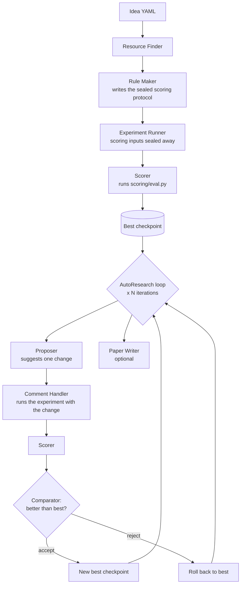

# AutoResearch

AutoResearch mode turns a single scored experiment into an iterative loop. For each iteration, the system proposes
one change, runs it, and scores it against a sealed evaluation protocol. Modificaiton is kept only if the the score improves against the current best. If the score does not improve, it rolls the
workspace back to the previous best. Every attempt is checkpointed and recorded
so the workspace always holds the best result and no attempt is lost.

## Usage

```bash
# Run the full scored pipeline from an idea, then 3 AutoResearch iterations
./neurico run <idea_id> --autoresearch --autoresearch-iterations 3

# Continue iterating on a workspace that already has a scored best result
./neurico run <idea_id> --continue-autoresearch --autoresearch-iterations 5

# Add scoring to a workspace whose experiment already ran, then iterate
./neurico run <idea_id> --bootstrap-rule-maker
./neurico run <idea_id> --continue-autoresearch --autoresearch-iterations 3
```

<details>
<summary><b>System Architecture</b></summary>

A `--autoresearch` run first executes the full scored pipeline to set a baseline,
then repeats the improvement loop for the requested number of iterations. It also writes the paper if requested.



One iteration runs these steps:

1. Restore the current best checkpoint.
2. Propose. The proposer agent reads the current results and suggests one change,
   written to the attempt's `proposal.md`.
3. Run. The comment handler re-runs the experiment with the change applied.
4. Score. The scorer executes the sealed `scoring/eval.py` and writes a new
   `results.json`.
5. Compare. A deterministic comparator checks the candidate's scored properties
   against the current best. The candidate is accepted only if it improves those
   properties with no pairing regression. Otherwise it is rejected.
6. Commit or roll back. An accepted candidate becomes the new best through a git
   checkpoint. A rejected candidate is rolled back so the workspace returns to
   the previous best.

Checkpoints are git commits in the workspace, and the best result is always the
current `HEAD`. Logs and paper drafts are kept across a rollback. Every attempt
including the rejected ones is saved under the history directory with proposal,
results, and accept/reject decision.

</details>

## Modes and when to use them


### Fresh AutoResearch (`--autoresearch`)

Run the full pipeline from an idea, then iterate on it.

Use this when you start from an idea and want the system to keep improving the
result against the metric, not just run once. `--autoresearch` turns on
`--enable-scoring`. The number of iterations can be set with `--autoresearch-iterations N`
(default 1).

```bash
./neurico run <idea_id> --autoresearch --autoresearch-iterations 3
```

### Continue (`--continue-autoresearch`)

'--continue-autoresearch' mode resumes autoresearch progress on a workspace that already holds a scored best result. This mode skips
the upstream stages (resource finding, rule making, and the initial experiment).

Use this when a prior scored run finished and you want more iterations, or you
want to continue from the current best without redoing setup. For this mode the existing workspace must have complete scoring files, a
valid git `HEAD`, and no uncommitted changes. It refuses to run otherwise. It cannot be combined with
`--autoresearch`.

If the workspace is dirty because a run was interrupted (for example a Slurm job killed at its wall clock), add `--continue-recover`. It restores the workspace to the current best checkpoint, discarding the interrupted attempt as if it were rejected, then continues instead of refusing.

```bash
./neurico run <idea_id> --continue-autoresearch --autoresearch-iterations 5
# resume after an interrupted run, discarding the incomplete attempt:
./neurico run <idea_id> --continue-autoresearch --continue-recover --autoresearch-iterations 5
```

### Bootstrap (`--bootstrap-rule-maker`)

'--bootstrap-rule-maker' mode adds scoring protocol to a workspace whose experiment already produced outputs but was not
run in scoring mode.

Use this when you want to start autoresearch on existing neurico workspace with no scoring protocol around it yet. 
It skips resource finding, the forward rule maker, and the experiment runner. It runs a two-pass `workspace_manifest` curation
(a mechanical pass and a trimmer agent) and a bootstrap rule maker to write the
protocol and score the existing implementation. Follow it with `--continue-autoresearch` to iterate on the
scored baseline. Relevant flag: `--manifest-trimmer-timeout`.

### Other flags

- `--comment-mode`: make targeted improvements based on comments in the idea file.
  Use it when you already know the changes you want and do not need the loop.
- `--force-fresh`: ignore an existing local workspace and start a run from scratch.

### Which mode to use

| Your situation | Use |
|---|---|
| Starting from an idea, want iterative improvement | `--autoresearch --autoresearch-iterations N` |
| Already have a scored best, want more iterations | `--continue-autoresearch` |
| Have an existing unscored workspace to improve | `--bootstrap-rule-maker`, then `--continue-autoresearch` |
| Want a single scored run, no iteration | `--enable-scoring` |

## Flags

| Flag | Type / default | Description |
|---|---|---|
| `--autoresearch` | switch | Run the AutoResearch loop after the initial scored experiment (turns on `--enable-scoring`) |
| `--autoresearch-iterations N` | int, default `1` | Number of AutoResearch iterations |
| `--continue-autoresearch` | switch | Continue from an existing scored workspace, skipping upstream stages |
| `--autoresearch-history-dir PATH` | path, default `logs/experiment-autoresearch` | Where per-attempt history is stored |
| `--enable-scoring` | switch | Scoring mode: add a `rule_maker` stage and a `scorer` stage |
| `--rule-maker-timeout SECONDS` | int, default `1800` | Timeout for the rule_maker stage (scoring only) |
| `--scorer-timeout SECONDS` | int, default `600` | Timeout for the scorer stage (scoring only) |
| `--bootstrap-rule-maker` | switch | Add scoring to a workspace whose experiment already ran |
| `--manifest-trimmer-timeout SECONDS` | int, default `300` | Timeout per `manifest_trimmer` call (bootstrap only) |
| `--comment-mode` | switch | Make targeted improvements from comments in the idea file |
| `--force-fresh` | switch | Ignore an existing local workspace and start fresh |

## Outputs

- Best result: `scoring/results.json` in the workspace. It is the workspace's git
  `HEAD`.
- Attempt history: `logs/experiment-autoresearch/<parent_sha>/attempt-<n>/`, with
  each attempt's `proposal.md`, its results, and the accept/reject decision.
  Rejected attempts are kept too.

## Constraints

- `--autoresearch` requires scoring and turns it on automatically.
- `--autoresearch` and `--continue-autoresearch` cannot be combined.
- `--continue-autoresearch` needs a clean, already-scored workspace: no
  uncommitted changes, scoring files present, and a valid git `HEAD`.
- Bootstrap is a separate entry point. Combine it with `--continue-autoresearch`
  to iterate after the scored baseline exists.
