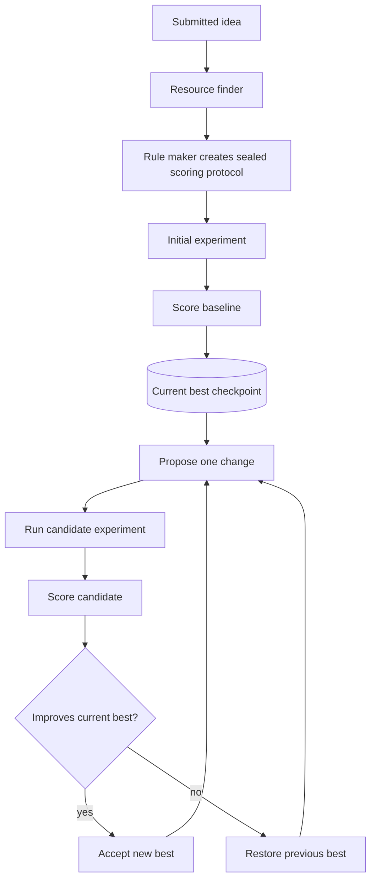

# AutoResearch

AutoResearch is one of NeuriCo's three research modes. It turns an initial
scored experiment into an iterative improvement loop. Each iteration proposes
one change, runs it, scores it against a sealed evaluation protocol, and keeps
the change only when it improves the current best result.

Continue behavior is part of AutoResearch, not a separate user-facing mode.

## Start AutoResearch

The following example creates a scored baseline and runs three improvement
iterations:

| Docker | Local `uv` |
| --- | --- |
| `./neurico run <idea_id> --provider claude --no-github --full-permissions --autoresearch --autoresearch-iterations 3` | `uv run python src/core/runner.py <idea_id> --provider claude --no-github --full-permissions --autoresearch --autoresearch-iterations 3` |

Omit `--no-github` when the idea has a configured GitHub repository. Replace
`claude` with `codex` or `gemini` after authenticating that provider.

## Continue AutoResearch

Continue from a workspace that already contains a scored best result:

| Docker | Local `uv` |
| --- | --- |
| `./neurico run <idea_id> --provider claude --no-github --full-permissions --continue-autoresearch --autoresearch-iterations 3` | `uv run python src/core/runner.py <idea_id> --provider claude --no-github --full-permissions --continue-autoresearch --autoresearch-iterations 3` |

The existing workspace must have complete scoring files, a valid Git `HEAD`,
and no uncommitted changes. If an interrupted AutoResearch attempt left the
workspace dirty, add `--continue-recover`. This restores the current best
checkpoint, discards the incomplete attempt, and continues:

| Docker | Local `uv` |
| --- | --- |
| `./neurico run <idea_id> --provider claude --no-github --full-permissions --continue-autoresearch --continue-recover --autoresearch-iterations 3` | `uv run python src/core/runner.py <idea_id> --provider claude --no-github --full-permissions --continue-autoresearch --continue-recover --autoresearch-iterations 3` |

## How the loop works

One iteration performs these steps:

1. Restore the current best checkpoint.
2. Write one proposed change to the attempt's `proposal.md`.
3. Apply the proposal and run the candidate experiment.
4. Execute the sealed evaluator and write candidate results.
5. Compare the candidate against the current best.
6. Accept the candidate as the new best or restore the previous best.

The workspace Git `HEAD` always represents the current best accepted result.
Rejected attempts remain available in the history directory for review.

## Main flags

| Flag | Type / default | Description |
| --- | --- | --- |
| `--autoresearch` | switch | Create the scored baseline, then enter the AutoResearch loop |
| `--continue-autoresearch` | switch | Resume from an existing scored best workspace |
| `--continue-recover` | switch | Restore the best checkpoint before continuing an interrupted run |
| `--autoresearch-iterations N` | integer, default `1` | Number of improvement iterations |
| `--autoresearch-history-dir PATH` | path, default `logs/experiment-autoresearch` | Attempt-history location |

`--autoresearch` and `--continue-autoresearch` cannot be combined.

## Outputs

- Current best score: `scoring/results.json`.
- Current best implementation: the workspace Git `HEAD`.
- Attempt history:
  `logs/experiment-autoresearch/<parent_sha>/attempt-<n>/`.
- Per-attempt artifacts: proposal, results, and accept/reject decision.
- Optional paper: `paper_draft/` when `--write-paper` is enabled.

For human-guided iterative research, use HITL AutoResearch instead. See
[`HITL_AUTORESEARCH.md`](HITL_AUTORESEARCH.md).
