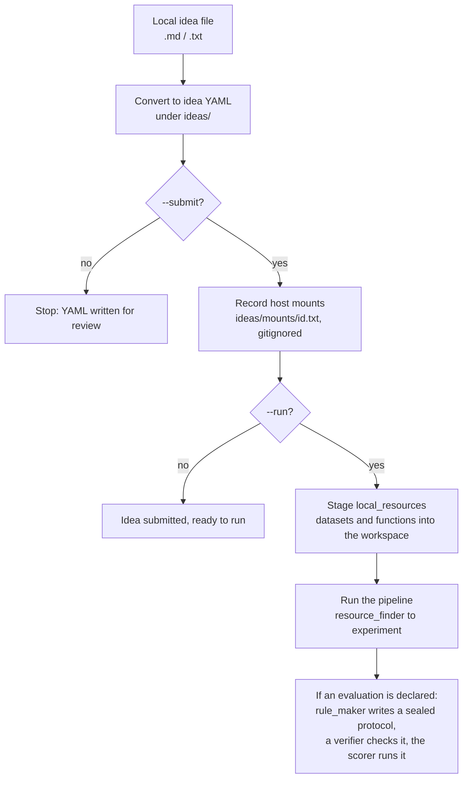

# Local Idea Submission

Local idea submission lets you run NeuriCo on an idea backed by files already on
your machine. You point it at a plain idea file, declare the datasets and
functions the experiment must use, and optionally a metric to score against.
Declared resources are staged into the workspace as contractual inputs, and the
declared evaluation is honored verbatim, so the run uses your data and your
metric rather than searching for its own.

## Usage

```bash
# Convert a local idea file into a NeuriCo idea (writes YAML under ideas/)
./neurico submit-local idea.md

# Convert and submit it (creates the workspace and, unless --no-github, the repo)
./neurico submit-local idea.md --submit

# Convert, submit, and immediately run the research
./neurico submit-local idea.md --submit --run --provider claude
```

<details>
<summary><b>Submission pipeline</b></summary>

Submission converts the idea file and records the declared host paths; staging
into the workspace happens when the run dispatches, so the resource is present
and verifiable for the whole pipeline.



Submission and run cover these steps:

1. Convert. The idea file is turned into a structured idea YAML under `ideas/`. A
   faithfulness check confirms that local paths mentioned in the file survived
   into a usable location and were not dropped into prose.
2. Mount. At submit time the declared host paths are written to a gitignored
   `ideas/mounts/<id>.txt`; for Docker runs they are mounted read-only when the
   run dispatches. Paths not declared are not visible inside the container.
3. Stage. When the run starts, each declared resource is resolved, copied into
   the workspace under a sanitized name, and recorded with a `sha256`. Later
   stages verify the staged bytes against that record, so a tampered staged file
   fails the run.
4. Run. The pipeline runs against the staged copies. When an evaluation is
   declared, the rule maker writes a sealed scoring protocol that uses your
   metrics and mandated functions verbatim, a verifier confirms the protocol
   matches the contract, and the scorer runs it.

Host paths stay local. The workspace `.neurico/idea.yaml` is written with
`source_path` redacted, so absolute paths remain only in your local `ideas/`
directory and the gitignored mounts sidecar.

</details>

## What you can declare

These live under `idea.local_resources` and `idea.evaluation` in the idea. The
converter fills them in from the idea file, and you can edit the generated YAML
directly.

### Local datasets

`local_resources.datasets`: files or directories already on your machine, each
with a `path` and a binding `usage`. They are staged into `datasets/local/` in the
workspace so the agent uses your copy.

Use this when the experiment must run on specific data you already have, rather
than searching for or downloading a dataset.

### Local functions

`local_resources.functions`: a Python file `path`, the `entrypoint` function name,
and its `usage`. Staged into `code/local/`. Set `required_for_evaluation: true` to
bind all evaluation to that function: `scoring/eval.py` must call it rather than
reimplementing the metric, and a verifier enforces this before the scoring
contract is sealed.

Use this when the experiment or the metric must call your code, for example a
protocol-specific evaluator you want scoring to route through.

### Evaluation contract

`evaluation`: a list of `metrics` (each with a `name`, a `definition`, and an
optional `target`) and an optional `results_format`. Declared metrics are
transcribed verbatim into `scoring/targets.json`, tagged `source: user`. A metric
may omit its target, in which case the rule maker derives one and tags it
`source: derived`.

Use this when you want the run measured against your own metric and threshold. It
turns on scoring for the run (see [docs/AUTORESEARCH.md](AUTORESEARCH.md) for the
scoring stages).

## Flags

| Flag | Description |
|---|---|
| `--submit` | Submit the idea after conversion (creates the workspace) |
| `--run` | Run research immediately after submission (requires `--submit`) |
| `--provider claude\|codex\|gemini` | Provider for repo naming and `--run` execution |
| `--output PATH` | Where to write the converted YAML (default: auto under `ideas/`) |
| `--no-github` | Skip GitHub repository creation (only with `--submit`) |
| `--github-org ORG` | GitHub organization (default: `GITHUB_ORG` env var) |
| `--private` | Create a private GitHub repository |
| `--no-hash` | Simpler repo names (skip the random hash) |
| `--no-full-permissions` | Run agents without full permissions (default: on) |
| `--no-write-paper` | Skip the paper draft after experiments (default: on) |
| `--paper-style neurips\|icml\|acl\|ams` | Paper format (default: auto-detect from domain) |
| `--paper-timeout SECONDS` | Timeout for paper writing (default: 3600) |

## Outputs

- Converted idea: `ideas/<id>.yaml`.
- Staged datasets: `datasets/local/<name>` in the workspace. Staged functions:
  `code/local/<name>`.
- Integrity record: each staged resource carries a `sha256`. The scorer verifies
  the staged bytes against the read-only source before running.
- Host mounts (Docker): `ideas/mounts/<id>.txt`, gitignored.

## Constraints

- `--run` requires `--submit`.
- Declared `local_resources` paths must exist on the host at submit time. Relative
  paths resolve against the host working directory.
- `required_for_evaluation` binds the scorer to your function. The run fails the
  verifier gate if `scoring/eval.py` bypasses or reimplements it.
- Docker runs mount only the declared paths, read-only. A path the experiment
  needs but does not declare will not be available inside the container.
